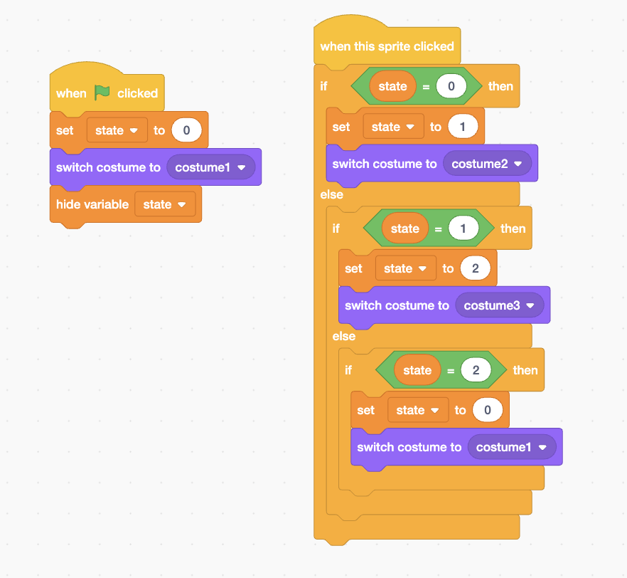

[Home](https://kaankutluer.github.io/kaankutluer.github.io/) | [Projects](projects.md) | [Big Ideas](big_ideas.md) | [Documentation](documentation.md)

# **[Projects](https://kaankutluer.github.io/kaankutluer.github.io/tree/main/Projects)**

### **[Swift Playground - Clock V3 (Final Before the Final: V5)]**

- A pretty basic clock app that changes the hour and/or minute once the buttons on the screen are clicked accordingly. Show the hour and the minute(s) while also showing whether it is AM or PM.

# **[Practice Projects](https://github.com/badebasligil/kaankutluer.github.io/tree/main/Project/Practice_Projects)**

### **[Swift Playground - Fake XOX You Can't Play](https://kaankutluer.github.io/kaankutluer.github.io/tree/main/Projects/Swift_Playground)**

- Colorful boxes that have either "X" or "O" inside them.

  

### **[Swift Playground - Calculator](https://kaankutluer.github.io/kaankutluer.github.io/blob/main/Projects/Swift_Playground)**

- A calculator app that does (you guessed it!) calculations via the inputs the user puts into the system.

  

**[The Full Code with all the Comments](https://kaankutluer.github.io/kaankutluer.github.io/blob/main/Projects/Swift_Playground/Calculator App Codes with Comments)**

### **[Scratch - Toe Tac Tic That You Can Actually Play!](https://kaankutluer.github.io/kaankutluer.github.io/blob/main/Projects/Block_Coding)**

- Simplest Tic-Tac-Toe Game (Literally). The game is meant to be played with a friend (you probably don't have one like me), with each click switching each box between X, O and blank.

  
